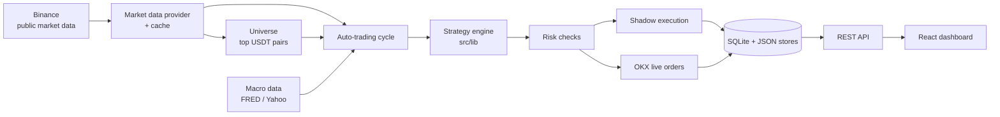
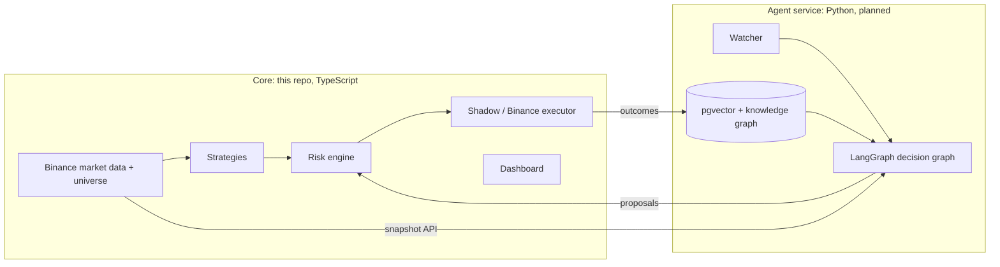

# Architecture

This document describes how CryptoQuant AI works today and where it is heading. For setup and usage see [running.md](running.md); for the build plan see [roadmap.md](roadmap.md).

## Overview

CryptoQuant AI is a single Node.js service (the **core**) that contains:

- an **Express backend** that pulls market data, runs the auto-trading loop, applies risk checks, executes trades (shadow or OKX live), stores results and serves an API;
- a **React dashboard** (Vite) served by the same process;
- local persistence in **SQLite** and **JSON files** under `DATA_DIR` (default `./data`).

A separate **Python agent service** (LangGraph, LLM agents, memory) is planned; see [Target architecture](#target-architecture).

## Request and process flow

- `server.ts` imports `server/env.ts` first (loads `.env`), then calls `createApp()` from `server/app.ts` and listens on `PORT` (default 3000).
- `createApp()` loads the audit store, app store, SQLite database and credential vault, hydrates the auto-trading engine, starts the take-profit manager, installs `requireOperator` on `/api`, registers all route groups, and serves the frontend (Vite middleware in development, `dist/` in production).
- Background work runs in-process: the auto-trading engine schedules cycles with `setTimeout`; the take-profit manager runs every 60 seconds.

## Modules

### Market data (`server/market/`)

| File | Responsibility |
| --- | --- |
| `providers.ts` | `MarketDataProvider` interface: `ticker`, `tickers`, `orderBook`, `ohlcv`, `ohlcvPage`, `funding`, `spotMarkets`, `ping`. `BinanceMarketDataProvider` (ccxt `binance`/`binanceus`, spot) and `OkxMarketDataProvider` (OKX public REST, USDT swaps). `getMarketDataProvider()` picks one from `DATA_EXCHANGE` (default `binance`). |
| `public-data.ts` | Cached wrappers used everywhere else: `fetchPublicTickerSnapshot`, `fetchPublicTickers`, `fetchPublicOrderBookSnapshot`, `fetchPublicFundingSnapshot`, `fetchPublicOhlcvSnapshot`, `fetchPublicMarketBundle(WithAutoRetry)`. Cache keys include the provider id. Also `fetchOkxExecutionTickerSnapshot` (OKX prices for order sizing) and `assertMarketDataReady` (preflight). |
| `universe.ts` | `getUniverseSnapshot(config)`: ranks active USDT pairs by 24h quote volume (selection logic in `src/lib/universe.ts`), refreshes hourly, serves a stale snapshot if a refresh fails (retry after 5 minutes). In live mode it keeps only pairs OKX lists as USDT swaps. |
| `macro.ts` | Macro data cache (FRED, Yahoo Finance) feeding the macro gate. |

Binance funding rates come from USD-M perpetuals (`binanceusdm`) as context only: one request for all pairs, cached 60 seconds. Pairs without a perpetual get a neutral rate; a futures outage never blocks spot data.

### Auto-trading (`server/trading/`)

| File | Responsibility |
| --- | --- |
| `auto-trading-engine.ts` | `AutoTradingEngine`: start/stop/run-once, scheduling, config updates, status. Start requires OKX credentials only for live mode; shadow mode can run on market data alone. |
| `auto-trading-cycle.ts` | `runAutoTradingCycle(config, trigger)`: one scan. See [The scan cycle](#the-scan-cycle). |
| `scan-targets.ts` | `buildScanTargets`, `mapWithConcurrency`, `checkMarketDataFreshness`, `getShadowPaperEquity`. |
| `shadow-sync.ts` | Opens, refreshes or reverses shadow positions from a candidate. |
| `take-profit-manager.ts` | Manages take-profit orders for live OKX positions. |
| `engine-helpers.ts` | Credentials resolution, macro snapshot, take-profit consensus. |

### Strategy logic (`src/lib/`)

Pure functions shared by server and UI, each with tests:

- `strategyEngine.ts`: regime detection (`TREND_UP`, `TREND_DOWN`, `RANGE`, `RISK_OFF`), strategies `trend-breakout`, `mean-reversion`, `regime-engine`, `risk-kill-switch`, and the macro gate (`ALLOW_FULL`, `ALLOW_REDUCED`, `BLOCK_NEW_RISK`).
- `tradingRuntime.ts`: runtime context from ticker/order book/candles, risk-managed position sizing, shadow execution estimates, default risk config.
- `indicators.ts`: RSI, SMA, standard deviation, MACD and others.
- `universe.ts`: universe selection and config sanitizing.
- `walkForwardBacktest.ts`, `backtestValidation.ts`, `ohlcvHistory.ts`: walk-forward validation and diagnostics.
- `portfolioReturns.ts`, `portfolioReturnStability.ts`: return analytics.

### Execution and exchange (`server/execution/`, `server/exchange/`)

- `execution/okx-orders.ts`: `submitOkxOrder` for USDT perpetual swaps with attached TP/SL (`attachAlgoOrds`). Sizes with OKX prices.
- `exchange/okx.ts`: symbol conversion, OKX market resolution, public API helper, auto-trading preflight.
- `exchange/okx-account.ts`: balance and position normalization, private fetches.
- `exchange/connectivity.ts`: optional proxy (`EXCHANGE_PROXY_URL`), connectivity status reported to the dashboard (`okxPublic`, `okxPrivate`, `marketData`, `proxy`).

### Persistence (`server/persistence/`, `server/stores/`)

| Store | Location | Contents |
| --- | --- | --- |
| SQLite | `DATA_DIR/trading.sqlite` | `trades`, `strategy_signals` (pruned after `STRATEGY_SIGNAL_RETENTION_DAYS`, default 14), shadow orders |
| App store | `DATA_DIR/app-store.json` | sessions, security events, order lifecycle, risk state, auto-trading config, logs (200), cycle summaries (50), decision traces (500) |
| Audit store | `DATA_DIR/audit-store.json` | AI snapshots, order receipts, risk events, position changes |
| Credential vault | `DATA_DIR/credentials.enc.json` | OKX and AI keys entered in the dashboard, encrypted with `APP_SECRET` |

`persistAppStore()` coalesces writes: calls made while a write is queued share it.

### Auth (`server/auth/`)

- One operator account (`ADMIN_USERNAME`/`ADMIN_PASSWORD`). Login returns a bearer token; sessions expire after `SESSION_TTL_HOURS`.
- `requireOperator` protects `/api/*` except login/session, `GET /api/config/status`, `GET /api/macro`, and public market data (`/api/market/*` and `/api/okx/*` ticker, tickers, orderbook, ohlcv, funding, source).

### Frontend (`src/app/`)

`ConsoleApp.tsx` hosts nine pages: Dashboard, Market, History, Portfolio, Backtest, Reliability, Audit, Diagnostics, Settings. Data comes from polling hooks (`hooks/*`) calling the REST API via `api.ts`. The header symbol list shows scanned pairs by volume; the scan panel edits manual scan profiles and universe settings.

## The scan cycle

`runAutoTradingCycle` runs every 5 minutes by default (1–15 minutes depending on the macro gate):

1. **Credentials**: with OKX credentials, balance and positions come from OKX. Without them, shadow mode uses a paper balance (`SHADOW_PAPER_EQUITY_USDT`) and counts open shadow orders as positions; live mode refuses to run.
2. **Macro gate and persistent risk**: `BLOCK_NEW_RISK` or an active cooldown ends the cycle early.
3. **Maintenance**: open shadow orders are marked to market and closed on TP/SL.
4. **Portfolio slots**: at most 2 concurrent positions (1 under `ALLOW_REDUCED`).
5. **Targets**: manual scan profiles plus universe pairs × universe timeframes, deduplicated.
6. **Fetch**: market data bundles (ticker, funding, order book, candles) fetched 8 at a time.
7. **Per target**: freshness check → strategy evaluation for each enabled strategy → confidence gate → macro gate → candidate. Every step is recorded in a decision trace.
8. **Selection**: timeframe conflicts rejected, best timeframe per symbol kept, correlated same-direction exposure halved, slots filled by score.
9. **Execution**: position sizing, then a shadow position (shadow mode) or an OKX order (live).

To keep storage bounded, universe pairs record only BUY/SELL strategy signals and skip HOLD traces; manual profiles record everything.

## API summary

| Group | Endpoints |
| --- | --- |
| Auth | `POST /api/auth/login`, `GET /api/auth/session`, `POST /api/auth/logout` |
| Config | `GET /api/config/status`, `POST/DELETE /api/config/credentials` |
| Market data | `GET /api/market/{ticker,orderbook,ohlcv,funding}/:symbol`, `GET /api/market/tickers`, `GET /api/market/universe`, `GET /api/market/source` (`/api/okx/*` aliases), `GET /api/macro` |
| Auto-trading | `GET /api/auto-trading/{status,config,logs,traces,cycles}`, `PUT /api/auto-trading/config`, `POST /api/auto-trading/{start,stop,run-once}` |
| Risk and audit | `GET/POST /api/risk/state`, `POST /api/risk/kill-switch/reset`, `GET /api/audit/summary`, `GET /api/audit/logs/:type`, `POST /api/audit/risk-event`, `GET /api/security/events`, `GET /api/orders/lifecycle` |
| Records | `GET /api/trades`, `POST /api/trades/record`, `GET /api/strategy/signals`, `GET /api/shadow/{orders,summary}`, `GET /api/portfolio/returns`, `GET /api/research/weekly` |
| OKX account | `POST /api/okx/{balance,positions,history,realized-pnl,order}` |
| Backtest | `POST /api/backtest`, `POST /api/backtest/walk-forward` |
| Other | `POST /api/ai/analyze` (Zhipu GLM), `POST /api/notify` (SMTP) |

## Design principles

- **Agents propose, code disposes.** Only the risk checks can hand orders to execution; future LLM agents will submit proposals, never orders.
- **Shadow first.** Shadow mode is the default; live trading requires an explicit live config and OKX credentials.
- **Data venue and execution venue are separate.** Market data comes from `DATA_EXCHANGE`; orders go to OKX and are sized with OKX prices.
- **Pure logic in `src/lib`**, tested without network access.

## Target architecture

The plan (Option A in the design doc) keeps this core as the deterministic trading engine and dashboard, and adds a Python agent service:

- The agent service reads snapshots from the core (`/api/agent/*`, planned) and posts `TradeProposal`s back; the core's risk checks decide.
- It holds no exchange credentials and is reachable only on a private network with a service token.
- Storage moves to Postgres (TimescaleDB for candles, pgvector for agent memory) in a later phase.

See [roadmap.md](roadmap.md) for when each piece lands.
